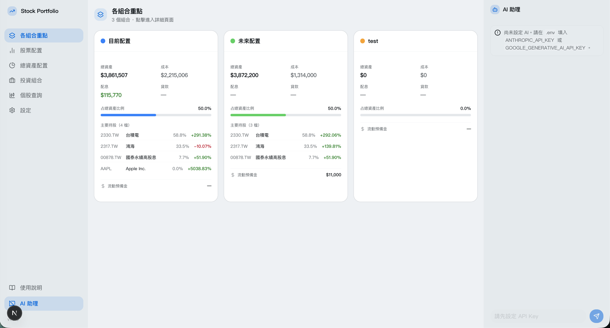
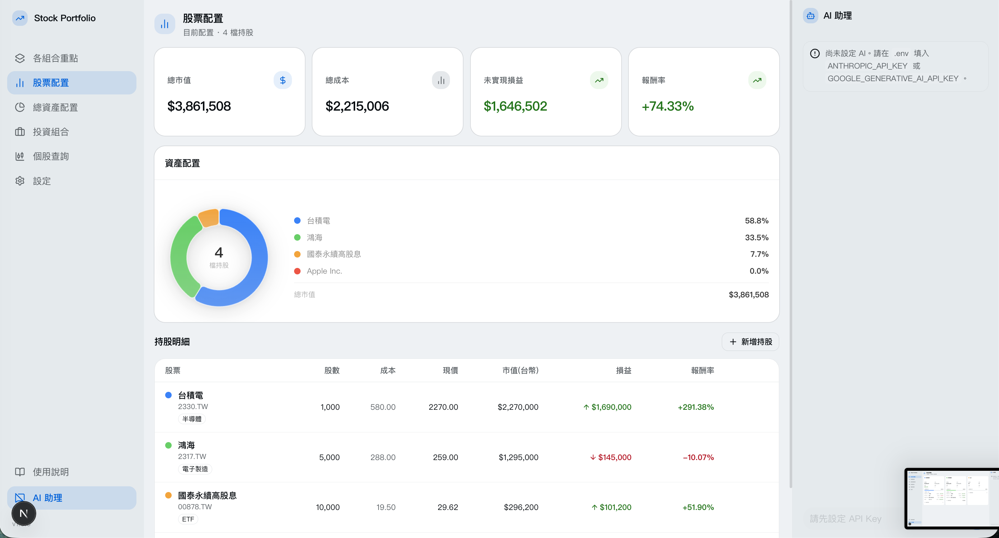
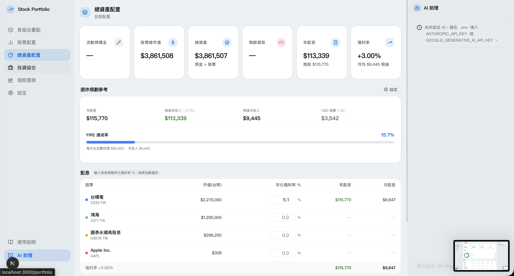

# Stock Portfolio Manager v1.1.0

個人股票資產管理工具，支援多套投資組合、即時損益、配息試算、退休規劃、個股 K 線查詢與 AI 聊天助理。

---

## 截圖







---

## 功能總覽

- **多套投資組合**管理，各組合資料獨立，可隨時切換
- **持股明細**：股數、平均成本、即時現價、預估收入（扣手續費與交易稅）、損益、報酬率
- **拖拉排序**：持股列可自由拖拉調整順序，自動儲存
- **資產配置**：台股 / 美股分開顯示的圓餅圖
- **總資產配置**：流動預備金、貸款管理
- **配息試算**：輸入年化殖利率，自動計算稅前/稅後年配息、月配息
- **退休規劃（FIRE）**：設定每月生活費目標，計算 FIRE 達成率
- **個股查詢**：搜尋任意股票，查看 K 線圖（1m～5y）、開高低量、本益比、EPS
- **新增持股自動搜尋**：輸入代號自動帶出中文名稱與幣別
- **深色 / 淺色 / 系統模式**切換
- **AI 聊天助理**：支援 Claude（Anthropic）、Gemini（Google）與 Groq（免費），依設定自動切換
- **AI 金鑰管理**：直接在設定頁輸入或移除 API Key，一鍵重啟生效
- **股價**由 Yahoo Finance 自動取得，每 5 分鐘更新，免費無需 API Key

---

## 快速啟動

> **前置需求**：[Node.js 20+](https://nodejs.org/) 與 Git（[Windows](https://git-scm.com/download/win) / macOS：`xcode-select --install`）

### 步驟

```bash
# 1. Clone 專案
git clone https://github.com/JayHsiao0801/stock_portfolio.git
cd stock_portfolio
```

**macOS** — 先給予執行權限（只需一次），之後直接雙擊即可：

```bash
chmod +x start.command
```

**Windows** — 開啟命令提示字元（cmd），切換到專案目錄後執行：

```cmd
start.bat
```

> **注意**：請勿直接雙擊 `start.bat`，應從 cmd 執行以便看到錯誤訊息。
> 若尚未安裝 Node.js，請先前往 [nodejs.org](https://nodejs.org/) 下載安裝（建議選 LTS 版本），安裝完後重新開啟 cmd 再執行。

腳本會自動完成：複製設定檔、安裝依賴、初始化資料庫，然後啟動伺服器。

> 啟動後在瀏覽器開啟 **http://localhost:3000**
>
> AI API Key 可在 App 側邊欄 →「設定」頁面輸入，無需手動編輯任何檔案。

---

## API Key 說明

| Key | 用途 | 是否必填 | 申請 |
|-----|------|---------|------|
| `GROQ_API_KEY` | Groq AI 聊天（**免費**） | 選填 | [console.groq.com](https://console.groq.com) |
| `ANTHROPIC_API_KEY` | Claude AI 聊天 | 選填 | [console.anthropic.com](https://console.anthropic.com) |
| `GOOGLE_GENERATIVE_AI_API_KEY` | Gemini AI 聊天 | 選填 | [aistudio.google.com](https://aistudio.google.com/apikey) |
| 股價 API | yahoo-finance2 自動取得 | **不需要** | — |

- Key 都不填：App 正常運作，AI 聊天功能顯示未設定提示
- 只填一個：自動使用有設定的那個
- 填多個：UI 可自由切換 Claude / Gemini / Groq
- **可直接在設定頁（側邊欄 → 設定）輸入或移除 Key，無需手動編輯 `.env`**

---

## 股票代號格式

| 市場 | 格式 | 範例 |
|------|------|------|
| 台灣上市（TWSE） | 代號 + `.TW` | `2330.TW`、`0050.TW` |
| 台灣上櫃（TPEx） | 代號 + `.TWO` | `6781.TWO` |
| 台灣 ETF（上市） | 代號 + `.TW` | `00878.TW`、`0056.TW` |
| 美股 | 直接填代號 | `AAPL`、`NVDA`、`VOO` |

---

## 開發指令

```bash
npm run dev          # 啟動開發伺服器
npm run build        # 生產環境 build
npm run start        # 啟動生產伺服器（需先 build）
npm run db:seed      # 載入示範資料
npm run db:reset     # 重置資料庫
```

---

## 技術棧

- [Next.js 16](https://nextjs.org/) — 全端框架
- [Prisma 6](https://www.prisma.io/) + SQLite — 資料庫
- [Tailwind CSS v4](https://tailwindcss.com/) + [shadcn/ui](https://ui.shadcn.com/) — UI
- [lightweight-charts](https://tradingview.github.io/lightweight-charts/) — K 線圖（Apache 2.0）
- [yahoo-finance2](https://github.com/gadicc/node-yahoo-finance2) — 股價與搜尋
- [Vercel AI SDK](https://sdk.vercel.ai/) — Claude / Gemini 串流
- [Zustand](https://github.com/pmndrs/zustand) — 狀態管理
- [@dnd-kit](https://dndkit.com/) — 拖拉排序
- [next-themes](https://github.com/pacocoursey/next-themes) — 深淺色主題

---

## 常見問題

### `npm install` 出現 `EACCES permission denied`（macOS）

原因是 npm 快取目錄的擁有者不是當前使用者（通常是之前用 `sudo` 執行過 npm 導致）。

```bash
sudo chown -R $(whoami) ~/.npm
```

修復後重新執行 `npm install`。Windows 通常不會遇到此問題，若出現權限錯誤請以系統管理員身分開啟命令提示字元後重試。

---

### `prisma migrate deploy` 失敗，提示 Node.js 版本不符

本專案使用 **Prisma 6**，相容 Node.js 20.x 任何版本。若看到：

```
Prisma only supports Node.js >= 20.19+
```

代表系統安裝的是 Prisma 7（需 Node.js 20.19+）。解法：

```bash
# 明確安裝 Prisma 6
npm install prisma@^6 @prisma/client@^6
```

或將 Node.js 升級至 20.19 以上的 LTS 版本。

---

### 資料庫路徑錯誤：`Error code 14: Unable to open the database file`

請確認 `.env` 的 `DATABASE_URL` 保持預設格式：

```
DATABASE_URL="file:./dev.db"
```

不要改成絕對路徑，程式內部已處理路徑轉換。

---

## 資料備份

所有資料存在本機 `prisma/dev.db`（SQLite），不會上傳雲端。換機前請備份此檔案。
